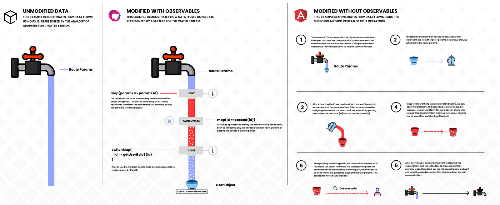

# Clase 02 - Angular

## Ayuda Angular Cli

```sh
ng --help
```

## Crear un proyecto angular

```sh
ng new <nombre-proyecto>
ng new intro-angular # ejemplo
```

## NPM -> Node Package Manager
Se instala con Node. Es un gestor de librerías (paquetes)

```sh
npm --version
```

NPM -> Genera 2 archivos y una carpeta

* node_modules/
* package-lock.json (dependencias de dependencia)
* package.json


## Dependencias

* dependencies (Utilizas en producción)
* devDependencies (Utilizas en desarrollo) | Parecido a Live Server

## Recuperar los node_modules (recostruir)
Los node_modules no se comparten, no se suben a GitHub

```sh
npm i # npm install | leer el package.json
```

## Listar scripts que están dentro del package.json

```sh
npm run
```

## Arrancar el entorno de desarrollo

```sh
npm start
```

## Detengo el servidor de desarrollo

Ctrl + C

## /public

* Imagenes (Bitmap)
* Videos
* Fuentes (Tipografías)
* Vectores (SVG)

## /src (sources)
Código fuente...

## Editor Config
Configura el editor basado en el archivo .editorconfig

<https://editorconfig.org/>

## tsconfig.app.json | tsconfig.json | tsconfig.spec.json
Configuraciones respecto de como va a procesaro los archivos ts el motor de typescript

## angular.json 
Configuraciones del proyecto de angular

## Crear componentes con Angular CLI

```sh
ng generate component <carpeta>/<nombre>
ng generate component componentes/formularios
ng g c componentes/formularios
```

## Extensión de Chrome y Firefox

<https://angular.dev/tools/devtools>
<https://chromewebstore.google.com/detail/angular-devtools/ienfalfjdbdpebioblfackkekamfmbnh>
<https://addons.mozilla.org/en-US/firefox/addon/angular-devtools/>

# Patrones de diseño

<https://refactoring.guru/es>


## Crear directiva con Angular CLI

```sh
ng generate directive <carpeta>/<nombre>
ng generate directive directivas/resaltar
ng g d directivas/resaltar
```

# Subir un proyecto a la nube (Hacer un deploy)

1. Detener el servidor de desarrollo

2. Hacer el build del proyecto. O sea crear la carpeta dist (distribucción)

```sh
npm run build
```

3. Arrastrar la carpeta (browser) a la zona de drag and drop de netlify

<https://www.netlify.com/>

## Versionado semantico

<https://semver.org/lang/es/>

## Verificar versiones de librerías del proyecto.

```sh
npm outdated
```

## Para actualizar la librería a la última versión

```sh
npm i nombre-librería@latest
npm i nombre-librería@19.2.15
npm i nombre-librería@19.1.10
```

## Crear un servicio con ng

```sh
ng generate service /nombre-carpeta/nombre-servicio
ng g s /nombre-carpeta/nombre-servicio
ng g s servicios/clientes
```

## Incoporando JSON SERVER con herramienta de desarrollo

<https://github.com/typicode/json-server>

```sh
npm install json-server -D
```

### Creamos la carpeta data y dentro el archivo db.json

```json
{
  "productos": [
    { "id": 1, "nombre": "PC", "precio": 123 },
    { "id": 2, "nombre": "Notebook", "precio": 223 },
    { "id": 3, "nombre": "Tablet", "precio": 113 },
    { "id": 4, "nombre": "Celular", "precio": 423 }
  ]
}
```

> package.json

```json
"scripts": {
    "server": "json-server --watch ./data/db.json --port 8080"
  },
```

## Arracamos el servidor

```sh
npm run server
```

## Detener json-server

Ctrl + C


## MockaAPI (Parecido a JSON Server en la nube)

<https://mockapi.io/>

## Observables



## Subir el proyecto a la NUBE (Hacer el deploy)

<https://www.netlify.com/>


